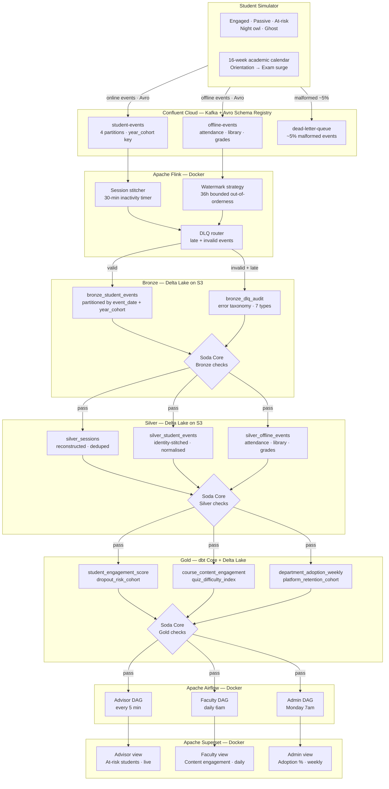

# EduPulse Analytics

[](https://python.org)
[](https://confluent.io)
[](https://flink.apache.org)
[](https://delta.io)
[](https://getdbt.com)
[](https://airflow.apache.org)
[](https://soda.io)
[](https://superset.apache.org)
[](LICENSE)

Universities generate millions of student behavioral signals every day and act on almost none of them. EduPulse is the open-source data infrastructure that closes that gap — turning raw LMS events into early dropout warnings, content effectiveness signals, and platform adoption trends, delivered to the right stakeholder at the right time.

---

## The Problem

Academic advisors find out a student is at dropout risk when exam results come back — weeks too late to change the outcome. The LMS generates millions of behavioral signals daily: logins, video plays, quiz attempts, forum posts, assignment submissions, library check-ins. None of it surfaces to the people who could act on it. Commercial analytics platforms like Amplitude and Mixpanel solve parts of this problem but cost $40–80k/year in licensing alone, pricing out most institutions. EduPulse replicates every capability on a fully open-source, free-tier stack at zero licensing cost.

---

## Architecture



**Three design invariants:**
- Bronze is append-only — raw events are never modified, only enriched downstream
- All layer transitions are gated on Soda Core checks — quality contracts are not optional
- Kafka partition key = `year_cohort` — aligns with the Delta partition column for advisor query pruning

---

## Stack

| Layer | Tool | Reason |
|-------|------|--------|
| Ingestion | Kafka (Confluent Cloud) | Durable, replayable, decoupled |
| Schema enforcement | Confluent Schema Registry (Avro) | Contract-driven from Day 1 |
| Stream processing | Apache Flink (Docker) | Stateful operators, true streaming |
| Storage | Delta Lake on AWS S3 | ACID, time travel, schema evolution |
| Transformation | dbt Core | Modular, tested, lineage-tracked |
| Quality | Soda Core | Contracts at every boundary |
| Orchestration | Apache Airflow (Docker) | DAG-based, observable |
| Dashboards | Apache Superset (Docker) | Open-source, role-based |
| Metadata | PostgreSQL (Docker) | Airflow + Superset backend |
| IaC | Terraform | Confluent + S3 provisioning |
| Language | Python 3.11+ | Consistent across all components |

## Working Process

Development moves through small, reviewable milestones on separate branches, with
`main` kept stable. See [Project Process](docs/process.md) for branch flow,
review expectations, and validation commands.

---

## Three Hard Problems

### Late-arriving offline events

**Problem:** Campus attendance and library systems sync with delays up to 36 hours. Raw timestamps cannot be trusted for stream-time ordering.

**Solution:** Flink bounded out-of-orderness watermark set to 36h max lateness. Events that arrive beyond the watermark are routed to the Dead Letter Queue with `late_arrival` as the error type, preserving the event for audit without polluting the main stream.

**Interview line:** "We matched the watermark to the campus IT sync SLA — not a guess, a measured constraint."

---

### Sparse event properties

**Problem:** A `page_view` event has 3 properties. A `video_event` has 47. There is no fixed schema that fits both without either wasting columns or losing data.

**Solution:** Hybrid storage — fixed columns for high-frequency properties shared across all event types, a JSON variant column for the long tail. dbt macros extract from the variant column in Gold models, keeping Bronze and Silver schema-stable while Gold surfaces only what each consumer needs.

**Interview line:** "Wide table = thousands of NULLs. EAV = slow queries. Hybrid = best of both at this scale."

---

### Session stitching in stream

**Problem:** Raw LMS events have no session concept. Session boundaries must be derived, and students may be anonymous when a session starts and identified mid-session after login.

**Solution:** Stateful Flink operator with a 30-minute inactivity timer per student. State is keyed by a device fingerprint for pre-login events. When a login event arrives, the operator merges the anonymous pre-login session into the identified session — no events are dropped, no sessions are split.

**Interview line:** "Batch SQL session windows give you yesterday's sessions. Advisors need today's — that's why it's in Flink."

---

## Three Dashboards

| Dashboard | Consumer | Freshness SLA | Primary question answered |
|-----------|----------|---------------|--------------------------|
| Advisor | Academic Advisor | < 5 min | Which students are at dropout risk right now? |
| Faculty | Lecturer | Daily 6am | Which lecture content is failing students? |
| Admin | Dept Head | Weekly Mon 7am | Which departments have lowest platform adoption? |

---

## Simulation Design

The simulator generates realistic LMS behavioral data without requiring a live institution.

**Student personas**

| Persona | Share | Behavior |
|---------|-------|----------|
| Engaged | 25% | Consistent daily activity, completes content ahead of deadline |
| Passive | 35% | Sporadic logins, partial content completion, deadline-driven |
| At-risk | 20% | Declining activity curve, missed assignments, no forum participation |
| Night owl | 12% | Full engagement but shifted to 22:00–03:00 UTC |
| Ghost | 8% | Near-zero activity after week 2 |

**Year cohorts:** Year 1–4, each with distinct behavioral distributions and event frequency profiles.

**Academic calendar:** 16-week semester — orientation spike (week 1), midterm pressure (weeks 7–8), exam surge (weeks 14–15), dropout cliff (weeks 4–5 and 9–10).

**Online events:** `page_view`, `video_play`, `video_pause`, `video_seek`, `quiz_attempt`, `quiz_answer`, `assignment_submit`, `forum_post`, `forum_reply`

**Offline events:** `attendance` (0–8h delay), `library_rfid` (0–36h delay), `grade_record` (weekly batch)

**Malformed events:** ~5% intentional → DLQ with 7-error taxonomy (see below)

**Run modes:**
```bash
python simulator/main.py --mode=live        # continuous real-time production
python simulator/main.py --mode=backfill --weeks=16  # full semester replay
```

The local simulator emits newline-delimited JSON to stdout by default. Use
`--limit` for smoke tests and `--output` to write events to a file.

**Local pipeline smoke test:**
```bash
make pipeline-local
```

This generates simulator events, validates them against the event contract, routes
invalid records to the Bronze DLQ audit table, builds Silver event/session outputs,
and writes Gold engagement/adoption metrics under `.local/lakehouse`.

**Local quality checks:**
```bash
make quality-local
```

Quality checks are enforced after Bronze, Silver, and Gold in the local pipeline.
If a layer fails, downstream layers do not run.

**Local dashboard assets:**
```bash
make dashboards-local
```

This prepares Advisor, Faculty, and Admin dashboard datasets plus a manifest under
`.local/superset`, using the Gold outputs produced by the local pipeline.

---

## DLQ Error Taxonomy

Every event routed to the Dead Letter Queue carries a structured `error_type` header drawn from this taxonomy:

- `missing_field`
- `schema_mismatch`
- `invalid_timestamp`
- `duplicate_event`
- `null_student_id`
- `invalid_event_type`
- `late_arrival`

---

## Repository Structure

```
edupulse-analytics/
├── simulator/          # Student behavior simulator
├── producers/          # Kafka producers per event type
├── schemas/            # Avro schemas + Schema Registry setup
├── flink/              # Flink consumer, session stitcher, DLQ handler
├── bronze/             # Delta Lake Bronze writer + schemas
├── silver/             # Delta Lake Silver transforms
├── dbt/                # dbt project (Silver → Gold models)
├── soda/               # Soda Core checks per layer
├── airflow/            # DAGs + custom operators
├── superset/           # Dashboard configs + role definitions
├── terraform/          # Confluent Cloud + S3 IaC
├── docker-compose.yml  # Full local stack
├── config/             # Centralized config
├── tests/              # Unit + integration + E2E tests
├── docs/               # Architecture diagrams, ADRs, case study
└── .env.example        # All required env vars documented
```

---

## 6-Day Build Plan

| Day | Date | Scope | Milestone |
|-----|------|-------|-----------|
| Day 1 | Tuesday | Repo + scaffold + simulator | v0.1 — simulator generating live events |
| Day 2 | Wednesday | Kafka + Avro + Flink + Bronze | v0.2 — events flowing end-to-end into Delta Lake |
| Day 3 | Thursday | Silver + dbt Gold | v0.3 — Gold engagement scores queryable |
| Day 4 | Friday | Soda + Airflow | v0.4 — pipeline orchestrated, contracts enforced |
| Day 5 | Saturday | Superset dashboards | v0.5 — all 3 dashboards live |
| Day 6 | Sunday | Tests + case study + interview prep | v1.0 — demo-ready, interview-ready |

---

## Getting Started

### 1. Clone and configure

```bash
git clone https://github.com/arcofiero/edupulse-analytics.git
cd edupulse-analytics
cp .env.example .env
# Edit .env — add Confluent Cloud credentials and S3 bucket
```

### 2. Start local stack

```bash
docker-compose up -d
# Airflow:    http://localhost:8080  (admin / admin)
# Superset:   http://localhost:8088  (admin / admin)
# Flink UI:   http://localhost:8081
# PostgreSQL: localhost:5432
```

### 3. Run simulator

```bash
python simulator/main.py --mode=live
```

### 4. Run tests

```bash
pytest tests/ -v
```

---

## Why Not Paid Tools

Databricks, Snowflake, and Amplitude solve parts of this problem. They also cost $40–80k/year in licensing, which prices out most institutions before a single query runs. EduPulse replicates every capability on open-source tools: free-tier Confluent Cloud for Kafka, free-tier S3 for Delta Lake storage, and local Docker for Flink, Airflow, and Superset. Zero licensing cost, full production-grade capability.

---

## License

MIT
