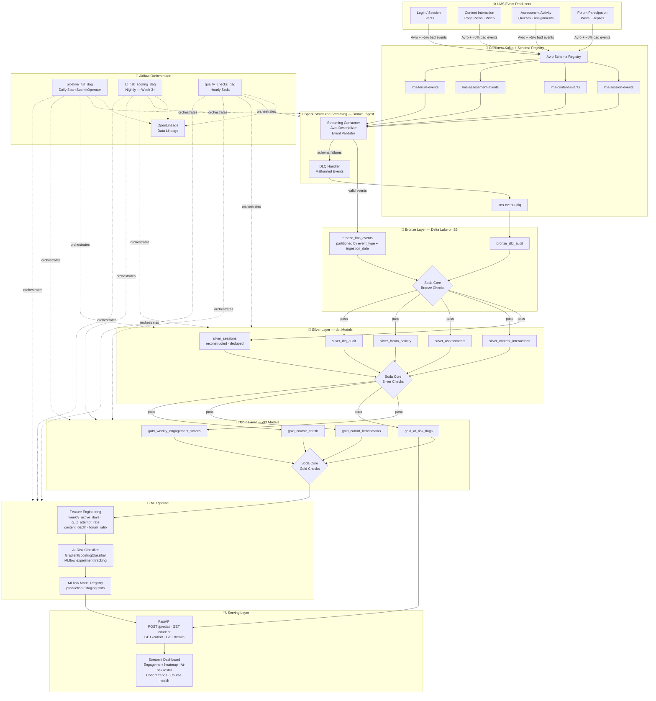

# EduPulse Analytics

[](https://python.org)
[](https://confluent.io)
[](https://spark.apache.org)
[](https://delta.io)
[](https://getdbt.com)
[](https://airflow.apache.org)
[](https://soda.io)
[](https://mlflow.org)
[](https://fastapi.tiangolo.com)
[](https://streamlit.io)
[](https://openlineage.io)
[](LICENSE)

> Open-source student behavioral analytics infrastructure for university LMS — real-time event ingestion through a medallion pipeline to engagement scoring, at-risk detection, and early intervention alerts.

---

## The Problem

University LMS platforms — Canvas, Moodle, Blackboard — generate millions of behavioral signals every day: logins, page views, quiz attempts, video engagement, forum posts, assignment submissions. Almost none of it is acted on in real time.

By the time a student appears on an advisor's radar, the semester is half over. The grade is already set.

This platform answers a different question: **what does infrastructure look like that turns behavioral data into early intervention signals before it's too late?**

- LMS events are ingested through Kafka, schema-enforced at the producer
- A medallion pipeline (Bronze → Silver → Gold) structures raw events into session-level features
- An engagement scoring model runs nightly and flags at-risk students by week 3
- Advisors see live signals in a dashboard — not a semester-end report

---

## Architecture



**Design invariants:**
- Bronze is append-only — raw events are never modified, only enriched downstream
- `event_id` is deterministic (`sha256(student_id + event_type + occurred_at + payload_hash)`) — pipeline is fully idempotent
- All layer transitions are gated on Soda Core checks — quality contracts are not optional
- At-risk scores are recomputed from Gold, never from the serving layer — model and data are decoupled
- OpenLineage tracks which raw events influenced which at-risk flags

---

## Stack

| Layer | Technology |
|-------|------------|
| Event streaming | Confluent Cloud Kafka · Avro · Schema Registry |
| Stream processing | Apache Spark Structured Streaming 3.5 |
| Batch transformation | dbt with Spark adapter |
| Storage | Delta Lake on AWS S3 |
| Data quality | Soda Core |
| ML tracking | MLflow (experiment tracking + model registry) |
| ML model | scikit-learn `GradientBoostingClassifier` |
| Orchestration | Apache Airflow 2.9 |
| Lineage | OpenLineage / Marquez |
| Query API | FastAPI |
| Dashboard | Streamlit |
| Infrastructure | Docker Compose |
| Language | Python 3.11+ |

---

## Key Metrics

| Metric | Value |
|--------|-------|
| Kafka topics | 5 (session, content, assessment, forum, DLQ) |
| Avro schemas | 4 registered event schemas |
| Bronze Delta tables | 2 (events + DLQ audit) |
| Silver dbt models | 5 |
| Gold dbt models | 4 |
| Soda Core checks | 60+ across Bronze, Silver, Gold |
| At-risk features | 8 per student-week |
| MLflow experiments | Versioned, with production/staging model slots |
| Airflow DAGs | 3 (full pipeline · nightly scoring · hourly quality) |
| FastAPI routes | 4 (predict · student · cohort · health) |

---

## Project Structure

```
edupulse-analytics/
├── producers/
│   ├── base_producer.py               # Avro serialiser wrapper, ~5% fault injection
│   ├── session_producer.py            # Login, logout, session duration events
│   ├── content_producer.py            # Page views, video watch events
│   ├── assessment_producer.py         # Quiz attempts, assignment submissions
│   └── forum_producer.py              # Posts, replies, reactions
├── schemas/
│   ├── lms_session_event.avsc         # Avro: session event envelope
│   ├── lms_content_event.avsc         # Avro: content interaction event
│   ├── lms_assessment_event.avsc      # Avro: assessment activity event
│   ├── lms_forum_event.avsc           # Avro: forum participation event
│   └── dead_letter_event.avsc         # Avro: DLQ error envelope
├── streaming/
│   ├── spark_streaming_consumer.py    # Spark Structured Streaming: Kafka → Delta Bronze
│   └── event_validator.py             # Two-pass validation (structural + business rules)
├── dbt_project/
│   ├── models/
│   │   ├── silver/                    # 5 Silver models: session reconstruct, dedup, enrich
│   │   └── gold/                      # 4 Gold models: engagement scores, at-risk flags, cohorts
│   ├── tests/                         # dbt schema tests
│   └── dbt_project.yml
├── soda/
│   ├── bronze/                        # Bronze quality checks
│   ├── silver/                        # Silver quality checks
│   └── gold/                          # Gold quality checks + freshness SLAs
├── ml/
│   ├── feature_engineering.py         # Builds student-week feature vectors from Gold
│   ├── train.py                       # GradientBoostingClassifier, MLflow experiment logging
│   ├── predict.py                     # Batch scoring: loads production model from MLflow registry
│   └── evaluate.py                    # Precision, recall, F1 at 0.5 threshold; confusion matrix
├── api/
│   ├── main.py                        # FastAPI app entry point
│   └── endpoints.py                   # /predict, /student/{id}, /cohort/{course_id}, /health
├── ui/
│   └── app.py                         # Streamlit: engagement heatmap, at-risk roster, course health
├── dags/
│   ├── pipeline_full_dag.py           # Daily: ingest → Silver → Gold → Soda
│   ├── at_risk_scoring_dag.py         # Nightly (Week 3+): feature engineering → predict → write flags
│   └── quality_checks_dag.py          # Hourly: Soda Core across all layers
├── lineage/
│   ├── emitter.py                     # OpenLineage START/COMPLETE/FAIL emitter
│   └── openlineage_config.yml
├── scripts/
│   ├── bootstrap.py                   # First-run: Kafka topics, Schema Registry, Delta table init
│   ├── run_all_producers.py           # Fires all four producers in parallel
│   └── e2e_smoke_test.py              # End-to-end pipeline smoke test
├── tests/
│   ├── test_producers.py
│   ├── test_streaming_consumer.py
│   ├── test_dbt_models.py
│   ├── test_feature_engineering.py
│   ├── test_ml_pipeline.py
│   └── test_api.py
├── conftest.py                        # Pytest fixtures (Spark session, mock Kafka, Delta tables)
├── docker-compose.yml                 # Kafka · Airflow · MLflow · Marquez
├── requirements.txt
├── .env.example
└── .gitignore
```

---

## Getting Started

### Prerequisites

- Python 3.11+
- Docker + Docker Compose
- Confluent Cloud account (free tier sufficient)
- AWS S3 bucket (or use local `/tmp` paths — configured in `.env.example`)

### 1. Clone and configure

```bash
git clone https://github.com/arcofiero/edupulse-analytics.git
cd edupulse-analytics
cp .env.example .env
# Edit .env — fill in Confluent Cloud and S3 credentials
```

### 2. Install dependencies

```bash
python -m venv .venv && source .venv/bin/activate
pip install -r requirements.txt
```

### 3. Bootstrap infrastructure

```bash
# Creates Kafka topics, registers Avro schemas, initialises Delta tables
python scripts/bootstrap.py
```

### 4. Start services

```bash
docker-compose up -d
# Airflow UI:   http://localhost:8080
# MLflow UI:    http://localhost:5000
# Marquez UI:   http://localhost:3000
# FastAPI docs: http://localhost:8000/docs
```

### 5. Produce LMS events

```bash
# Fires all four producers with ~5% malformed events
python scripts/run_all_producers.py
```

### 6. Run the pipeline

```bash
# Start Spark Structured Streaming (Bronze ingest)
spark-submit streaming/spark_streaming_consumer.py

# Run dbt Silver + Gold transformations
cd dbt_project && dbt run --profiles-dir ~/.dbt && cd ..

# Run Soda quality checks
python -m soda scan -d delta_lake soda/bronze/ soda/silver/ soda/gold/
```

### 7. Train and score

```bash
# Train at-risk classifier (logs to MLflow)
python ml/train.py

# Batch score current week (requires Gold data from Week 3 onward)
python ml/predict.py
```

### 8. Serve

```bash
# FastAPI
uvicorn api.main:app --port 8000

# Streamlit dashboard
streamlit run ui/app.py
```

### 9. Run tests

```bash
pytest tests/ -v
```

---

## At-Risk Detection

The at-risk classifier consumes a weekly snapshot of Gold-layer engagement metrics and predicts which students need advisor outreach before Week 5.

**Feature vector (per student-week)**

| Feature | Description |
|---------|-------------|
| `weekly_active_days` | Distinct days with any LMS activity |
| `session_count` | Total sessions in the week |
| `avg_session_duration_min` | Mean session length in minutes |
| `content_depth_score` | Pages viewed / total course pages |
| `video_completion_rate` | Proportion of assigned videos completed |
| `quiz_attempt_rate` | Quizzes attempted / quizzes available |
| `assignment_on_time_rate` | Submissions before deadline / total due |
| `forum_participation_ratio` | Forum posts + replies / class average |

**Model**
- `GradientBoostingClassifier` (scikit-learn)
- Training label: students who scored below passing threshold by week 10
- MLflow tracks every experiment run — hyperparameters, metrics, artefacts
- Production model promoted from staging via MLflow Model Registry

**Output**
At-risk flags are written back to `gold_at_risk_flags` after each nightly scoring run and surfaced through the FastAPI `/predict` and `/cohort/{course_id}` endpoints.

---

## Data Quality Contract

**Layer 1 — Schema Registry (Producer → Kafka)**
All events are serialised against registered Avro schemas. Non-conforming events are rejected at the producer, before they reach a Kafka topic.

**Layer 2 — Spark Validation (Kafka → Bronze)**
Two-pass validation on every consumed message:
1. Structural — required fields present, correct types
2. Business rules — student IDs non-null, timestamps within semester bounds, event type enum valid

Failures are routed to the Dead Letter Queue with structured error metadata.

**Layer 3 — Soda Core (Bronze → Silver → Gold)**
60+ automated checks block layer promotion. A failing check halts the Airflow DAG — no partial data advances.

```yaml
# Example: gold_weekly_engagement_scores
checks for gold_weekly_engagement_scores:
  - row_count > 0
  - missing_count(student_id) = 0
  - missing_count(course_id) = 0
  - min(weekly_active_days) >= 0
  - max(weekly_active_days) <= 7
  - missing_percent(engagement_score) < 1
  - freshness(computed_at) < 25h
```

---

## Design Decisions

**Why Kafka over direct DB writes from the LMS?**
LMS webhook payloads are unreliable — retries, duplicates, and schema drift are the norm. Kafka buffers and decouples ingestion from processing. The DLQ makes every failure visible and replayable.

**Why ~5% intentional bad events?**
The DLQ is a first-class feature. Bad events demonstrate that the platform catches, categorises, and audits failures in real time, which is essential in a university context where a dropped event could mean a missed intervention.

**Why a nightly scoring cadence and not real-time?**
At-risk prediction requires a week's worth of behavioral signal to be meaningful. Real-time scores on day one of a course are noise. The nightly DAG provides fresh scores every morning with a full feature vector.

**Why MLflow for a single model?**
Experiment tracking prevents the common failure mode of "which training run produced the model in production?" Model Registry provides a promotion workflow (staging → production) that makes rollback explicit and auditable.

**Why Delta Lake over plain Parquet?**
ACID transactions and time travel. Bronze is the permanent record of every raw LMS event — any Silver or Gold model can be recomputed from it without re-ingesting from the LMS.

---

## What's Next

- **Real-time engagement score** — rolling 7-day window in Spark Structured Streaming so advisors see a live score, not just a nightly batch
- **Intervention workflow API** — advisor actions (outreach sent, student responded) written back to a feedback table and used to retrain the classifier
- **Canvas / Moodle webhook connector** — replace the synthetic producers with real LMS webhook consumers
- **Terraform automation** — stubs in `infra/` for full Confluent + S3 + Airflow environment from `terraform apply`
- **Drift detection** — monitor feature distributions week-over-week; alert when the model's training distribution drifts from current semester behavior

---

## Build Plan

| Day | Focus | What landed |
|-----|-------|-------------|
| 0 | Repo scaffold | Architecture diagram, stack, design decisions, README |
| 1 | Infrastructure | Confluent Cloud Kafka topics, S3 Delta tables, Schema Registry |
| 2 | Event producers | 4 Kafka producers, Avro schemas, ~5% fault injection, DLQ |
| 3 | Spark Streaming → Bronze | Micro-batch consumer, two-pass validation, Delta Bronze write |
| 4 | Silver dbt models | Session reconstruction, content/assessment/forum normalisation |
| 5 | Gold dbt models | Engagement scores, at-risk flags, cohort benchmarks, course health |
| 6 | Soda Core contracts | 60+ checks across Bronze, Silver, Gold; Airflow quality DAG |
| 7 | ML pipeline | Feature engineering, GradientBoostingClassifier, MLflow tracking, Model Registry |
| 8 | Airflow orchestration | Full pipeline DAG, nightly scoring DAG, OpenLineage integration |
| 9 | Serving layer | FastAPI endpoints, Streamlit dashboard, engagement heatmap |
| 10 | Hardening + portfolio | Tests, load testing, LLD, known limitations |

---

## License

MIT
