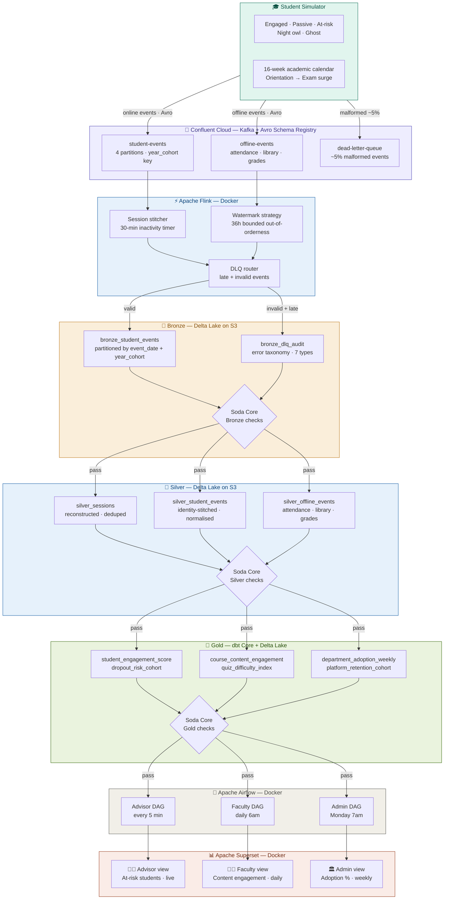

# EduPulse — Architecture

```mermaid
flowchart TD
    subgraph SIM["🎓 Student Simulator"]
        S1[Engaged · Passive · At-risk\nNight owl · Ghost]
        S2[16-week academic calendar\nOrientation → Exam surge]
    end

    subgraph KAFKA["📨 Confluent Cloud — Kafka + Avro Schema Registry"]
        K1[student-events\n4 partitions · year_cohort key]
        K2[offline-events\nattendance · library · grades]
        K3[dead-letter-queue\n~5% malformed events]
    end

    subgraph FLINK["⚡ Apache Flink — Docker"]
        F1[Session stitcher\n30-min inactivity timer]
        F2[Watermark strategy\n36h bounded out-of-orderness]
        F3[DLQ router\nlate + invalid events]
    end

    subgraph BRONZE["🥉 Bronze — Delta Lake on S3"]
        B1[bronze_student_events\npartitioned by event_date + year_cohort]
        B2[bronze_dlq_audit\nerror taxonomy · 7 types]
        SODA1{Soda Core\nBronze checks}
    end

    subgraph SILVER["🥈 Silver — Delta Lake on S3"]
        SV1[silver_sessions\nreconstructed · deduped]
        SV2[silver_student_events\nidentity-stitched · normalised]
        SV3[silver_offline_events\nattendance · library · grades]
        SODA2{Soda Core\nSilver checks}
    end

    subgraph GOLD["🥇 Gold — dbt Core + Delta Lake"]
        G1[student_engagement_score\ndropout_risk_cohort]
        G2[course_content_engagement\nquiz_difficulty_index]
        G3[department_adoption_weekly\nplatform_retention_cohort]
        SODA3{Soda Core\nGold checks}
    end

    subgraph AIRFLOW["🔁 Apache Airflow — Docker"]
        A1[Advisor DAG\nevery 5 min]
        A2[Faculty DAG\ndaily 6am]
        A3[Admin DAG\nMonday 7am]
    end

    subgraph SUPERSET["📊 Apache Superset — Docker"]
        D1[👩‍💼 Advisor view\nAt-risk students · live]
        D2[👨‍🏫 Faculty view\nContent engagement · daily]
        D3[🏛 Admin view\nAdoption % · weekly]
    end

    SIM -->|online events · Avro| K1
    SIM -->|offline events · Avro| K2
    SIM -->|malformed ~5%| K3

    K1 --> F1
    K2 --> F2
    F1 --> F3
    F2 --> F3
    F3 -->|valid| B1
    F3 -->|invalid + late| B2

    B1 --> SODA1
    B2 --> SODA1
    SODA1 -->|pass| SV1
    SODA1 -->|pass| SV2
    SODA1 -->|pass| SV3

    SV1 --> SODA2
    SV2 --> SODA2
    SV3 --> SODA2
    SODA2 -->|pass| G1
    SODA2 -->|pass| G2
    SODA2 -->|pass| G3

    G1 --> SODA3
    G2 --> SODA3
    G3 --> SODA3
    SODA3 -->|pass| A1
    SODA3 -->|pass| A2
    SODA3 -->|pass| A3

    A1 --> D1
    A2 --> D2
    A3 --> D3

    style SIM fill:#e1f5ee,stroke:#0f6e56,color:#085041
    style KAFKA fill:#eeedfe,stroke:#534ab7,color:#3c3489
    style FLINK fill:#e6f1fb,stroke:#185fa5,color:#0c447c
    style BRONZE fill:#faeeda,stroke:#ba7517,color:#854f0b
    style SILVER fill:#e6f1fb,stroke:#185fa5,color:#0c447c
    style GOLD fill:#eaf3de,stroke:#3b6d11,color:#27500a
    style AIRFLOW fill:#f1efe8,stroke:#5f5e5a,color:#444441
    style SUPERSET fill:#faece7,stroke:#993c1d,color:#712b13
```
